# 3-Build Lab

One landing page, built three times — **Full Site Editing**, **Elementor Pro**, and a
hand-written **ACF** theme — as a single WordPress multisite. Same design tokens, same content
model, same visual result. The implementations differ on purpose, and that difference is the
point of the project.

**[See it live →](https://zvgrys.github.io/zvg-multisite/)** — the built page itself, served as
static files. See [Notes on the live page](#notes-on-the-live-page).

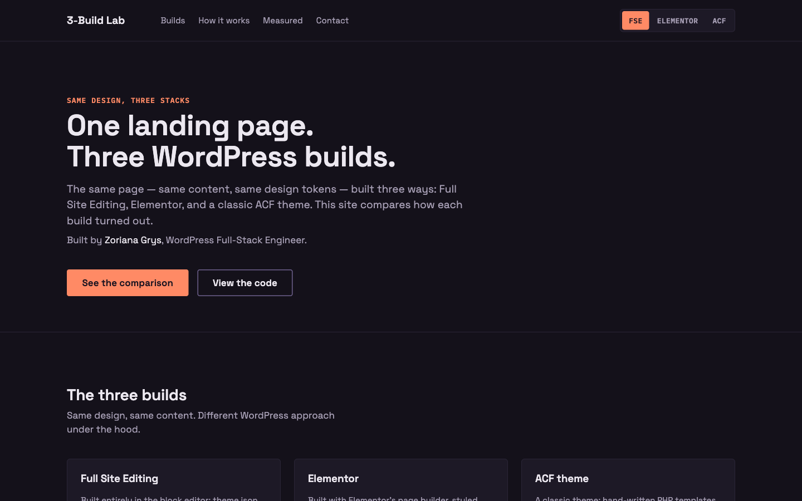

The three builds are visually indistinguishable. The only pixel that differs is which button in
the header switcher is lit — that is the result, not a coincidence.

<details>
<summary>All three builds at the same viewport, plus the mobile layout and the full page</summary>

<table>
  <tr>
    <th align="center">Full Site Editing</th>
    <th align="center">Elementor</th>
    <th align="center">ACF theme</th>
  </tr>
  <tr>
    <td></td>
    <td>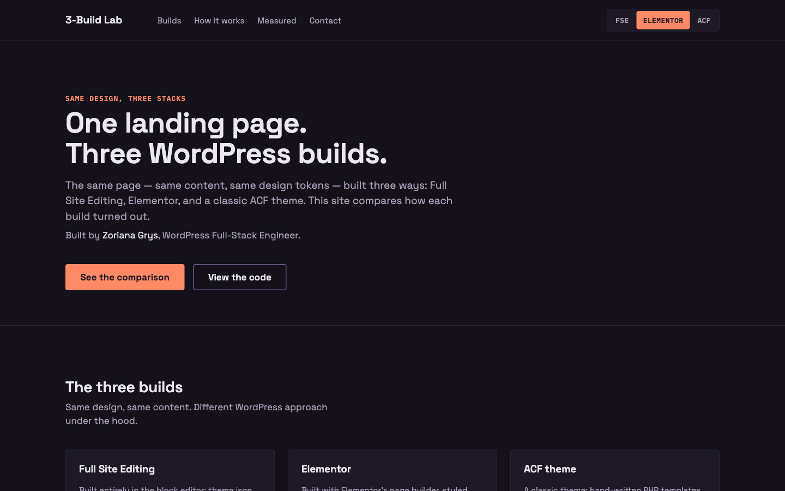</td>
    <td>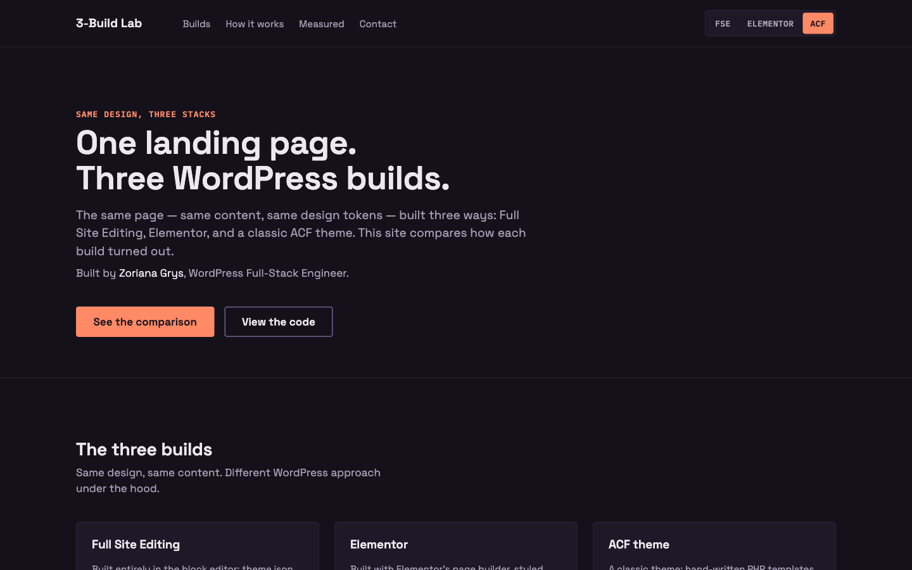</td>
  </tr>
</table>

<table>
  <tr>
    <th align="center">Mobile</th>
    <th align="center">The whole page</th>
  </tr>
  <tr>
    <td align="center">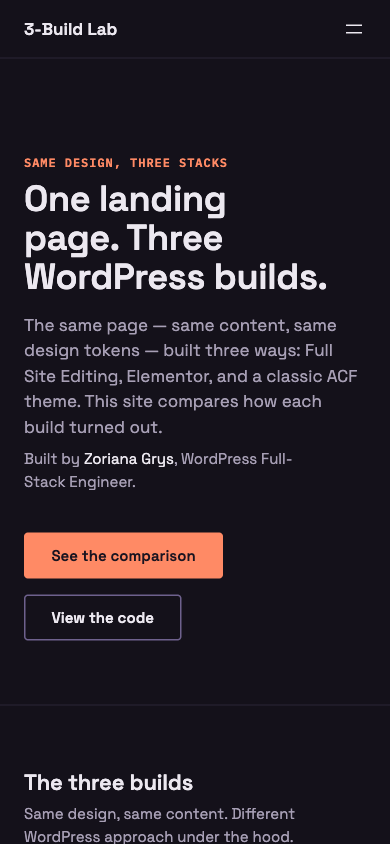</td>
    <td align="center">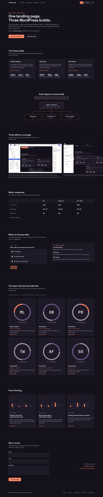</td>
  </tr>
</table>

</details>

## The three builds

<table>
  <tr>
    <th align="left"></th>
    <th align="left">Full Site Editing</th>
    <th align="left">Elementor Pro</th>
    <th align="left">ACF theme</th>
  </tr>
  <tr>
    <td>Theme</td>
    <td><code>zvg-fse</code></td>
    <td><code>zvg-elementor</code></td>
    <td><code>zvg-acf</code></td>
  </tr>
  <tr>
    <td>Layout authored in</td>
    <td>block patterns + <code>theme.json</code></td>
    <td>Elementor canvas + kit</td>
    <td>PHP section partials</td>
  </tr>
  <tr>
    <td>Header / footer</td>
    <td>template parts</td>
    <td>Theme Builder locations</td>
    <td><code>header.php</code> / <code>footer.php</code></td>
  </tr>
  <tr>
    <td>Editable content</td>
    <td>locked block pattern on the page</td>
    <td>Elementor widgets</td>
    <td>ACF flexible content</td>
  </tr>
  <tr>
    <td>Custom code</td>
    <td>10 blocks</td>
    <td>11 widgets</td>
    <td>10 section partials</td>
  </tr>
  <tr>
    <td>Field storage</td>
    <td>native post meta</td>
    <td>CMB2</td>
    <td>ACF Pro (<code>acf-json</code>)</td>
  </tr>
</table>

Every build renders the same nine sections, the same `zvg_member` custom post type with six
members, the same three blog posts, and the same contact form.

## What I measured

The same four checks, run against each finished build.

<table>
  <tr>
    <th align="left">Check</th>
    <th align="right">FSE</th>
    <th align="right">Elementor</th>
    <th align="right">ACF theme</th>
  </tr>
  <tr>
    <td>Lines of code</td>
    <td align="right">7 012</td>
    <td align="right">9 347</td>
    <td align="right"><b>6 652</b></td>
  </tr>
  <tr>
    <td>Page weight</td>
    <td align="right">341 KB</td>
    <td align="right">788 KB</td>
    <td align="right"><b>228 KB</b></td>
  </tr>
  <tr>
    <td>DOM nodes</td>
    <td align="right">576</td>
    <td align="right">580</td>
    <td align="right"><b>503</b></td>
  </tr>
  <tr>
    <td>Lighthouse mobile</td>
    <td align="right"><b>100</b></td>
    <td align="right">99</td>
    <td align="right"><b>100</b></td>
  </tr>
  <tr>
    <td>Largest Contentful Paint</td>
    <td align="right">1.4 s</td>
    <td align="right">2.0 s</td>
    <td align="right"><b>1.3 s</b></td>
  </tr>
</table>

**Lines of code** counts source only — `.php`, template `.html`, `.scss`, `.js`. No compiled
CSS, no `*.min.js`, no `.json`, no vendored libraries. **Page weight** is the landing page as a
guest receives it, admin bar hidden, uncompressed. **DOM nodes** are elements in the
server-rendered markup.

**Lighthouse mobile was measured against a static export of the three builds served from a CDN,
not against WordPress.** That is a deliberate choice and it changes what the number means:
server render time drops out of the picture entirely, so all three builds become the same kind of
file on the same host. What the score still reflects is the payload each stack produces — which
is the part a stack actually decides. Each figure is the median of three runs of Lighthouse 12
with the default mobile preset.

The score barely separates the three, and that is itself the finding: **served properly, all
three stacks are fast.** The honest difference is above that row — Elementor ships 3.5× the page
weight of the ACF theme and takes 0.7 s longer to paint its largest element, and it costs 2 700
more lines of code to maintain.

> The FSE line count has drifted by a few lines since it was last measured; the figures above are
> the ones the site itself reports. A full re-measure is queued.

## Same design, three editors

The same nine sections, in three editing surfaces.

<table>
  <tr>
    <td width="45%"><b>Full Site Editing</b><br>The sections are a locked pattern in the block editor.</td>
    <td>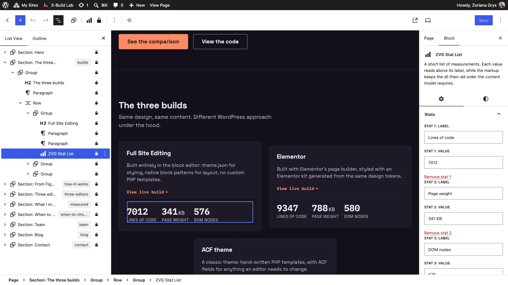</td>
  </tr>
  <tr>
    <td><b>Elementor</b><br>The same sections as containers on the Elementor canvas.</td>
    <td>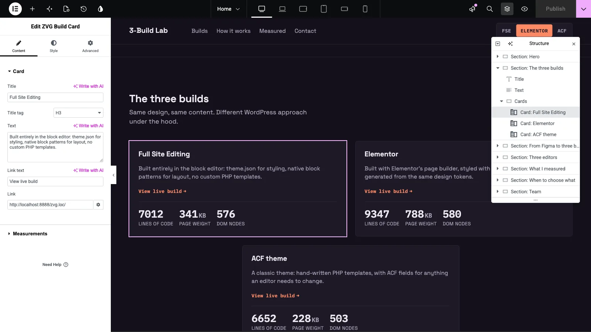</td>
  </tr>
  <tr>
    <td><b>ACF</b><br>The same sections as flexible-content layouts.</td>
    <td>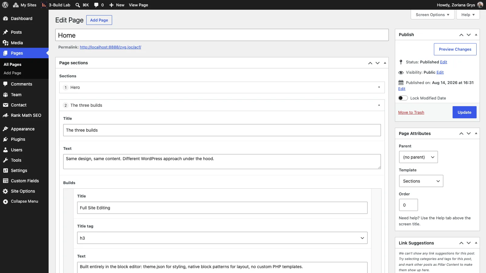</td>
  </tr>
</table>

The architectural difference shows up in where templates live:

<table>
  <tr>
    <th align="center">FSE templates</th>
    <th align="center">Elementor Theme Builder</th>
  </tr>
  <tr>
    <td>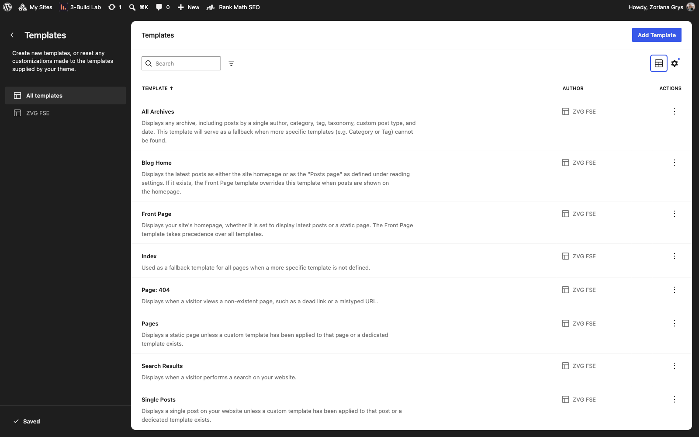</td>
    <td>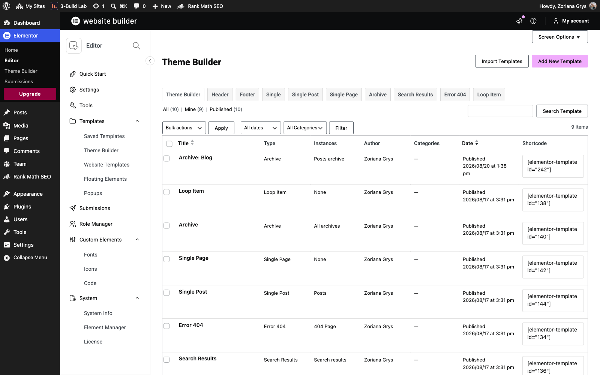</td>
  </tr>
</table>

And in how the ACF build stores its field definitions — nothing in the database, everything in
`acf-json/` in the theme, which is why the field group list reads `All (0)`:

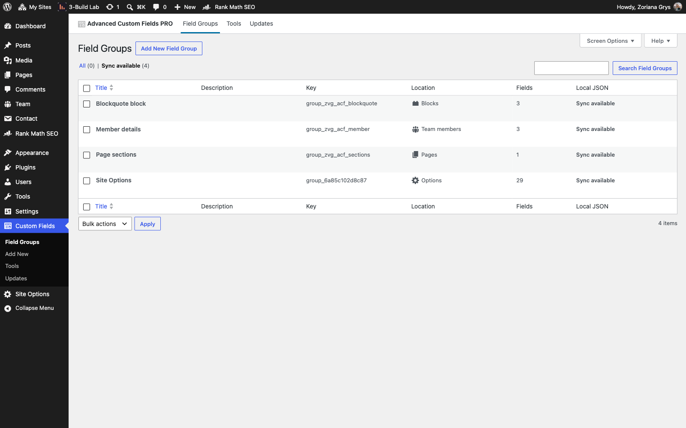

## Repository layout

The repository is rooted at WordPress's `wp-content/`, so it drops straight into an install.
Only own code is tracked — core, bundled themes, third-party plugins and uploads are excluded.

```
wp-content/
├── docs/img/                 screenshots used by this README
└── themes/
    ├── gulpfile.js           one build for all three themes
    ├── zvg-fse/              block theme — theme.json, patterns/, blocks/, templates/
    ├── zvg-acf/              classic theme — sections/, acf-json/, template-sections.php
    └── zvg-elementor/        classic theme — widgets/, cmb2/
```

## Build

The tooling sits one level above the themes and drives all three from one install.

```bash
cd wp-content/themes
npm install                 # first time only
npx gulp                    # build all, then watch
npx gulp build              # one-off build of all three
npx gulp build:zvg-fse      # a single theme
```

SCSS compiles to expanded, autoprefixed, minified CSS next to its source; JS goes through Babel
and uglify to `*.min.js`. **Edit the `.scss` and `.js` sources — never the generated files.**

## Notes on the live page

The published page is a static capture of the real WordPress output — the markup the templates
produced, with its own CSS, JS, fonts and images. The landing page, the blog index and the three
posts are all there and link to each other. All three builds render identically, so one of them
stands in for the set.

What a static capture cannot carry: the contact form renders but does not send, and search,
comments and the REST API are absent — there is no PHP behind them. The header's build switcher
is decorative here, since only one build is published.

Requires WordPress 6.7+ and PHP 7.4+ to run the builds themselves.

## Licence

© 2026 ZVGrys. All rights reserved. Code is published for review purposes only.
